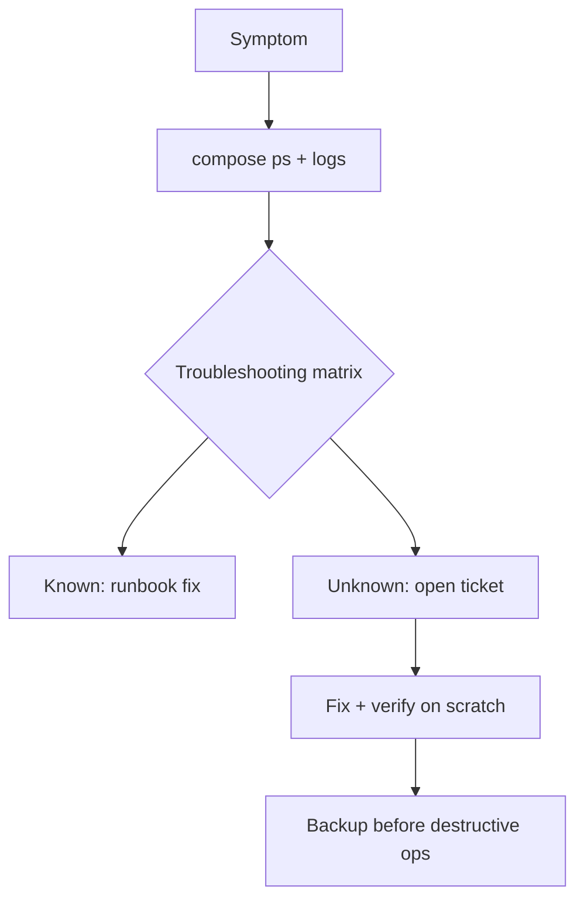

# shiftbase-ops

Operasional [Shiftbase](https://github.com/RakhaYandra/shiftbase): runbook
compose, skrip backup/restore MySQL teruji roundtrip, troubleshooting matrix
15 entri terverifikasi (termasuk port bentrok asli + distroless tanpa shell),
10 tiket + XLSX, SLA mini, FAQ.

## Purpose, Output & Expectations

**Purpose.** A multi-service HR stack (API + MySQL + Adminer) has more moving
parts than a single binary: containers, volumes, secrets, and a shell-less
distroless image. This repo keeps it operable — including the lessons from
real port conflicts and env-forwarding bugs found while testing the scripts.

**Output.** A compose runbook, tested mysqldump backup/restore scripts, a
15-entry matrix verified against a real compose stack (api 200, adminer 200,
mysql healthy), 10 tickets, and an SLA.

**Expectations.** After reading: compose lifecycle, backup discipline
(`down` vs `down -v`), and distroless debugging (logs + Adminer, never exec)
are understood; roundtrip restore is proven (5 employees + 3 users back).

## Features

| Feature | Description |
|---|---|
| Runbook | - Compose up/down, `.env`, migrate+seed, mysqldump backup/restore, rebuild, Adminer, secret rotation. - Purpose: operate the stack. Output: working commands. |
| Backup scripts | - mysqldump+gzip+rotation with env credentials; restore asks confirmation. - Purpose: survive `down -v`. Output: proven roundtrip. |
| Troubleshooting | - 15 entries incl. real 8080 conflict, distroless no-shell, seed 1062, 409/404 attendance. - Purpose: evidence over guesses. Output: 15/15 verified. |
| Tickets | - 10 tickets (severity → prevention), incl. real tooling incidents. - Purpose: support trail. Output: `Shiftbase-Tickets.xlsx`. |
| SLA + FAQ | - Targets plus user answers (overtime formula, CSV template, distroless). - Purpose: shared expectations. Output: agreed targets. |

## How It Works



## Isi

```
RUNBOOK.md, TROUBLESHOOTING.md, SLA.md, FAQ.md
scripts/shiftbase-backup.sh (mysqldump+gzip+rotasi, kredensial env)
scripts/shiftbase-restore.sh (konfirmasi tulis-ulang)
tickets.yaml -> tools/build_tickets.py -> Shiftbase-Tickets.xlsx
```

## Bukti uji

* Roundtrip: backup → hapus employees → restore → 5 employees + 3 users
* Compose full stack Up di port override (api 200, adminer 200, mysql healthy)
* `exec sh` di api gagal sesuai desain distroless; check-in ganda 409; seed ganda 1062
